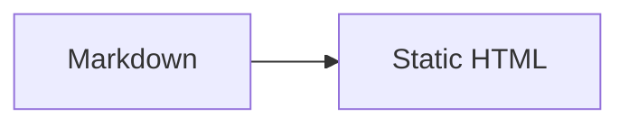

# mdrunner

## Overview

`mdrunner` is a small standalone CLI that turns one Markdown file into one finished HTML file and opens it in the user's default browser.

```bash
mdrunner ./README.md
```

The command performs all meaningful rendering before the browser opens:

- Markdown is converted to HTML.
- GFM features are rendered.
- Code blocks are syntax-highlighted.
- Mermaid fences are converted to inline SVG.
- Product CSS and local images are embedded.
- A complete HTML document is written to disk.
- The generated `file://` URL is opened.
- The process exits.

There is no HTTP server, localhost listener, background daemon, client-side Markdown parser, or client-side Mermaid renderer.

## Product principles

1. **One obvious command** — accept a Markdown path, generate the page, open it.
2. **Generation-time rendering** — the browser receives finished HTML, not work to perform.
3. **Self-contained output** — mdrunner-owned CSS, diagram SVG, highlighting styles, and local images are inline.
4. **Beautiful defaults** — typography, spacing, code, tables, diagrams, dark mode, and print output work without configuration.
5. **Safe defaults** — untrusted raw HTML and dangerous URL schemes do not become executable browser content.
6. **No feature theater** — avoid subcommands, configuration systems, engine selectors, and flags without a demonstrated need.
7. **High-value tests** — test user-visible behavior, failure modes, security boundaries, and the compiled executable rather than chasing superficial coverage.

## CLI contract

### Usage

```bash
mdrunner <file.md>
```

The CLI has:

- No subcommands.
- No server mode.
- No watch mode.
- No theme, renderer, Mermaid-engine, or output-format flags.
- Only conventional help handling may be added (`-h` / `--help`).

### Input

- Exactly one readable `.md` file path is required.
- Relative paths are resolved from the current working directory.
- Symlinks are resolved before reading.
- Missing files, directories, unsupported extensions, and unreadable files produce concise errors and a non-zero exit code.

### Output

The generated file is written atomically to a deterministic cache location under the operating system's temporary directory:

```text
<tmp>/mdrunner/<hash-of-canonical-source-path>/<source-name>.html
```

The same source path reuses the same output location. A successful run replaces the previous generated file. The file is not deleted when the CLI exits because the browser may still be loading or reloading it.

On success, mdrunner:

1. Prints the generated HTML path.
2. Opens its `file://` URL in the default browser.
3. Exits with status `0`.

If the browser cannot be opened, the generated file remains valid, its path is printed, and the command exits with a clear error.

## Output contract

A generated document must:

- Be a complete HTML5 document with doctype, language, charset, viewport, title, and body.
- Open directly through `file://` without a server.
- Contain no external mdrunner runtime assets.
- Contain no Mermaid runtime.
- Require no JavaScript for Markdown, diagrams, highlighting, or theme selection.
- Use inline CSS and `prefers-color-scheme` for automatic light/dark rendering.
- Embed local Markdown images as data URIs.
- Keep authored remote links and remote image URLs as remote URLs; mdrunner does not fetch arbitrary remote content.
- Be responsive and printable.
- Remain readable when an optional enhancement fails.

Small inline JavaScript enhancements are intentionally excluded initially. Copy buttons, theme toggles, diagram controls, and similar features are not worth adding until they demonstrate clear value.

## Features

### Markdown and GFM

Sätteri provides Markdown parsing and the MDAST/HAST transformation pipeline.

Supported initial syntax includes:

- Headings
- Paragraphs and line breaks
- Emphasis and strong emphasis
- Links and images
- Blockquotes
- Ordered and unordered lists
- GFM tables
- GFM task lists
- GFM strikethrough
- GFM autolinks
- GFM footnotes
- Fenced and indented code blocks
- Horizontal rules
- YAML/TOML frontmatter recognition

Heading IDs are generated deterministically and deduplicated so fragment links work in the static file.

The document title is selected in this order:

1. First level-one heading
2. Source filename without extension

Frontmatter remains available to the pipeline but is not treated as a configuration system in the initial version.

### Syntax highlighting

`satteri-expressive-code` and Expressive Code/Shiki render fenced code blocks during generation.

Initial behavior:

- Highlight common programming languages automatically.
- Preserve unknown languages as readable escaped code.
- Use coordinated light and dark themes.
- Render code tokens, frames, titles, and line markers statically.
- Inline all required highlighting CSS.
- Omit Expressive Code's JavaScript modules.

### Mermaid diagrams

A fenced block with language `mermaid` is converted to inline SVG during generation:

````markdown

````

`beautiful-mermaid` is the single initial diagram engine because it is synchronous, pure TypeScript, DOM-free, fast, themeable, and compatible with Bun standalone compilation.

Supported initial diagram families:

- Flowchart and state
- Sequence
- Class
- Entity relationship
- XY charts

There is no engine-selection flag and no silent fallback to a different renderer. Invalid or unsupported Mermaid syntax fails generation with a concise diagnostic identifying the source block. The browser is not opened with a knowingly incomplete document.

Official Mermaid through `Bun.WebView` is deliberately deferred. It can provide broader Mermaid compatibility without a server, but adds generation-time browser requirements and implementation complexity. It should only replace the initial engine if real documents demonstrate that the missing diagram families matter.

### Presentation

The HTML shell provides:

- Readable system-font typography
- A constrained, responsive content width
- Automatic light/dark colors through CSS media queries
- Accessible contrast and focus styles
- Styled headings, lists, quotes, tables, tasks, footnotes, code, and diagrams
- Horizontally scrollable wide tables and code blocks
- Responsive SVG diagrams
- Print styles that remove decorative chrome and avoid clipped content

The initial product does not include a table of contents, navigation sidebar, toolbar, settings UI, or custom theme system.

### Images and assets

- Relative local image paths are resolved against the Markdown file's directory.
- Local images are read during generation and embedded as typed base64 data URIs.
- Missing local images produce a source-aware generation error.
- Path resolution is canonicalized and tested for traversal and symlink edge cases.
- Remote images remain remote and are never fetched implicitly.
- Product CSS is compiled into the executable and inlined into each generated document.

## Security model

The source file may contain content that should not become executable merely because it was opened locally.

Initial policy:

- Raw HTML from Markdown is escaped or removed rather than passed through verbatim.
- Dangerous link and image protocols such as `javascript:` are rejected.
- Generated text and attributes are HTML/XML escaped.
- Mermaid source is rendered by the trusted static renderer, whose SVG text output is escaped.
- Generated SVG must not contain scripts, event-handler attributes, external resource loads, or unsafe links.
- No `eval`, dynamic remote modules, CDN scripts, or runtime Markdown rendering are used.
- File reads are limited to the requested Markdown file and explicitly referenced local assets.

Security transforms run before trusted code-highlighting and diagram-generation plugins so generated markup is not accidentally stripped while authored unsafe markup is not accidentally trusted.

Every security defect receives a permanent regression test.

## Processing pipeline

```text
CLI argument
  → canonicalize and validate source path
  → read UTF-8 Markdown
  → Sätteri parse to MDAST
  → source-level safety and document transforms
  → convert to HAST
  → sanitize links, images, and authored raw HTML
  → render Mermaid fences to trusted inline SVG
  → render remaining code fences with Expressive Code/Shiki
  → generate heading IDs and document metadata
  → embed local image assets
  → render HTML fragment
  → place fragment in the inline-styled HTML shell
  → validate final-document invariants
  → atomically write cached HTML file
  → open file URL
  → exit
```

Plugin order is part of the output and security contract and must be covered by integration tests.

## Technology stack and decisions

### Bun

Bun is used for:

- TypeScript execution during development
- Package management and lockfile
- File I/O
- Hashing and temporary-directory handling
- Process spawning for the default browser
- Test runner and assertions
- Bundling and standalone executable compilation

Release binaries are built with `bun build --compile` and include the Bun runtime. End users do not need Bun or Node installed.

### Sätteri instead of `Bun.markdown`

Sätteri is used because generation-time features need an AST pipeline. Its MDAST/HAST visitors provide clean, testable transforms for code blocks, Mermaid, images, heading IDs, safety rules, and future static features.

`Bun.markdown` remains an excellent simple HTML renderer, but using it here would require fragile HTML post-processing or a complete custom renderer. It is not the initial parser.

Sätteri is pre-1.0, so its exact version is pinned. Upgrades require a changelog review and full regression suite.

### Sätteri native binding packaging

Sätteri uses a platform-specific N-API addon. Bun's compiler does not automatically retain Sätteri's dynamically selected binding in the tested setup.

Each release target therefore has a small build bootstrap that:

1. Embeds the matching `.node` addon with Bun's file loader.
2. Sets `NAPI_RS_NATIVE_LIBRARY_PATH` to the embedded path.
3. Dynamically imports Sätteri after the path is configured.

This behavior must be smoke-tested from the compiled executable on every supported release platform. It is an accepted trade-off for the AST pipeline, not an implementation detail to leave untested.

### Expressive Code and Shiki

Used for generation-time syntax highlighting and code presentation. Runtime JavaScript modules are discarded; generated token markup and styles remain.

### beautiful-mermaid

Used for generation-time Mermaid-like SVG rendering. It is intentionally chosen over official Mermaid CLI because it requires no Puppeteer, Chromium download, DOM shim, server, or runtime JavaScript.

Its documented diagram coverage is an explicit product boundary.

### Browser opener

A small internal adapter opens the generated file with the platform default:

- macOS: `open`
- Linux: `xdg-open`
- Windows: PowerShell `Start-Process`

Commands are spawned with argument arrays rather than interpolated shell commands. The adapter is dependency-injected so tests never open a real browser.

## Testing strategy

All automated tests use `bun test`. Tests must be fast enough for normal local development while exercising the real parser and renderers wherever practical.

### Testing principles

- Prefer behavior and invariant assertions over large brittle snapshots.
- Use real Sätteri, Expressive Code, Shiki, and beautiful-mermaid in pipeline tests.
- Mock only true system boundaries such as browser launching.
- Keep a small number of carefully reviewed golden fixtures for representative complete documents.
- Assert both positive behavior and meaningful absence: no Mermaid runtime, no external product assets, no unsafe protocols, no executable raw HTML.
- Test failures and diagnostics as first-class product behavior.
- Every fixed bug adds a regression test that would have caught it.
- Coverage is reported and monitored, but line coverage never substitutes for boundary and integration tests.

### Unit tests

Focused tests cover logic with meaningful branching:

- CLI argument validation
- Canonical input and output path calculation
- Title selection
- Heading slug generation and collision handling
- URL protocol policy
- MIME detection and data-URI generation
- Local asset path resolution
- HTML attribute/text escaping
- Browser opener command selection
- Atomic output replacement
- Diagnostic formatting

### Pipeline integration tests

Fixture-based tests run the actual generation pipeline and verify:

- Core CommonMark rendering
- GFM tables, tasks, strikethrough, autolinks, and footnotes
- Heading IDs and duplicate headings
- Frontmatter exclusion from visible output
- Known-language syntax highlighting
- Unknown-language readable fallback
- Expressive Code title and marker metadata
- Mermaid conversion to inline SVG
- All supported Mermaid diagram families
- Invalid and unsupported Mermaid diagnostics
- Local PNG, JPEG, GIF, WebP, and SVG embedding
- Paths containing spaces and Unicode
- Missing asset failures
- Relative nested asset paths
- Light/dark CSS presence
- Print CSS presence
- Deterministic output for identical input

### Security tests

Adversarial fixtures verify that generated files do not contain executable content from:

- Raw `<script>` blocks
- Inline event handlers
- `javascript:` and mixed-case/encoded protocol variants
- Malicious image URLs
- SVG/script injection through Mermaid labels
- HTML-breaking code fence content
- Attribute-breaking titles and alt text
- Path traversal and symlink escapes
- Unexpected external scripts, stylesheets, fonts, or module imports

### Complete-document contract tests

Representative documents are generated and checked for:

- HTML5 doctype and required metadata
- Correct title and language
- One valid document root
- Inline product styles
- No mdrunner external assets
- No Mermaid runtime
- No required runtime JavaScript
- Valid embedded image data URIs
- Responsive diagram and table classes
- Stable, reviewed output structure

Only compact, stable portions of complete output are snapshot-tested. Volatile Shiki or SVG implementation details are checked semantically instead.

### CLI integration tests

Tests spawn the CLI in isolated temporary directories and assert:

- Successful generation from a relative and absolute path
- Printed output path
- Browser-opener invocation with the generated file URL
- Process exit codes
- Concise stderr diagnostics
- No output opening after generation failure
- Existing cached output is replaced atomically
- Paths with spaces, Unicode, and symlinks
- No lingering process, listener, or server port

### Compiled executable smoke tests

The release artifact itself is tested, not just source execution:

1. Build the standalone executable.
2. Run it against a representative fixture.
3. Verify successful Sätteri native binding startup.
4. Verify generated GFM, highlighted code, and Mermaid SVG.
5. Verify the browser opener was intercepted.
6. Verify the process exits and leaves no child process or listener.

Native CI runners should smoke-test their own platform artifacts. Cross-compilation success alone is insufficient evidence that the embedded N-API binding loads.

### Optional browser validation

A small end-to-end validation may open the generated `file://` document with `Bun.WebView` where supported and assert:

- The document loads without network requests for mdrunner assets.
- Static SVG diagrams are present and visible.
- Highlighted code is visible.
- No runtime rendering is needed.
- The layout does not overflow at representative viewport widths.

This complements generation tests; it does not introduce a browser requirement for normal unit tests.

## Quality gates

A change is ready when:

- `bun test` passes.
- Type checking passes.
- Formatting and linting pass.
- Relevant source, pipeline, security, CLI, and regression tests exist.
- The generated document contract still passes.
- A compiled executable smoke test passes for release-affecting changes.
- No server or listener has been introduced.
- No new CLI flag, dependency, or runtime script exists without a concrete user-facing justification.

## Supported releases

Initial release targets should be limited to platforms we can test natively:

- macOS arm64
- macOS x64 when a native runner is available
- Linux x64 when a native runner is available
- Windows x64 when a native runner is available

Additional architectures are added only with a working Sätteri binding and native compiled-artifact test coverage.

macOS release binaries should be signed and notarized before public distribution.

## Non-goals

The initial project is not:

- A Markdown editor
- A live preview server
- A file watcher
- A static-site generator
- A documentation website framework
- A multi-file navigator
- A browser extension
- A PDF generator
- An MDX runtime
- A plugin marketplace
- A configurable theme engine
- A complete implementation of every Mermaid diagram family
- A wrapper around dozens of renderer flags

Potential features such as KaTeX rendering, official Mermaid through `Bun.WebView`, a table of contents, or copy buttons require real user demand and high-value tests before entering scope.

## Definition of done for the initial product

The initial product is complete when a user can run:

```bash
mdrunner ./README.md
```

and receive a beautiful, safe, self-contained HTML file that:

- Opens directly through `file://`.
- Correctly renders the documented Markdown and GFM features.
- Contains statically highlighted code.
- Contains static SVG for every supported Mermaid fence.
- Embeds local images.
- Works in light, dark, responsive, and print contexts.
- Requires no server and no rendering-time JavaScript.
- Is generated by a standalone executable that exits immediately after opening it.
- Is protected by comprehensive Bun unit, pipeline, security, CLI, and compiled-artifact tests.

## Key references

- Sätteri: https://satteri.bruits.org/docs/
- Sätteri repository: https://github.com/bruits/satteri
- Sätteri Expressive Code: https://satteri.bruits.org/docs/expressive-code/
- Expressive Code: https://expressive-code.com/
- beautiful-mermaid: https://github.com/lukilabs/beautiful-mermaid
- Bun standalone executables: https://bun.com/docs/bundler/executables
