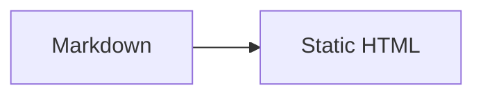
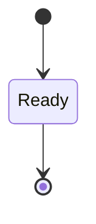
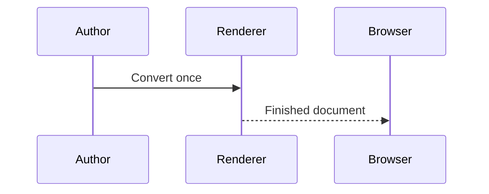
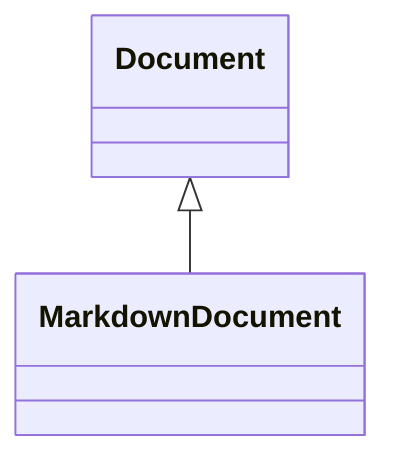
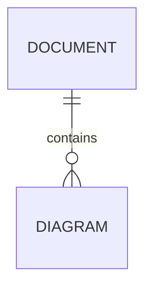
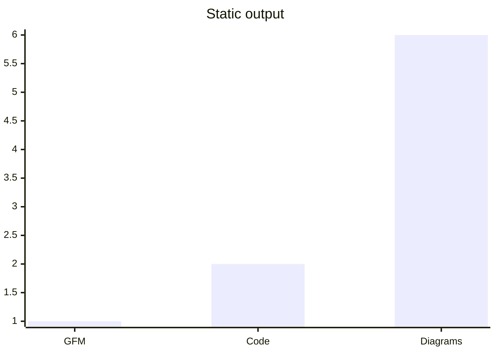

# Café 世界 — Static output

A **finished** document with _emphasis_, ~~obsolete text~~, `inline code`, an
<https://example.test/autolink>, and a footnote.[^contract]

## Repeated heading

## Repeated heading

## Unicode Καλημέρα

> Generation-time rendering keeps the browser simple.

- [x] GFM task complete
- [ ] Follow-up remains

| Feature | Status |                                                      Deliberately wide representative value |
| :------ | :----: | ------------------------------------------------------------------------------------------: |
| GFM     | ready  | abcdefghijklmnopqrstuvwxyz-ABCDEFGHIJKLMNOPQRSTUVWXYZ-0123456789-abcdefghijklmnopqrstuvwxyz |

[Remote documentation](https://docs.example.test/guide?q=static#output),
[email](mailto:reader@example.test), [telephone](tel:+12025550123),
[local guide](guide.md#start), and [fragment](#repeated-heading-2).


<script data-origin="authored">alert("must remain text")</script>













```ts title="complete.ts" {2}
const mode: string = "static";
console.log(mode);
```

```unknown-language
literal <tag> & a-layout-token-that-is-intentionally-long-abcdefghijklmnopqrstuvwxyz-0123456789-ABCDEFGHIJKLMNOPQRSTUVWXYZ
```

[^contract]: No runtime renderer is required.
